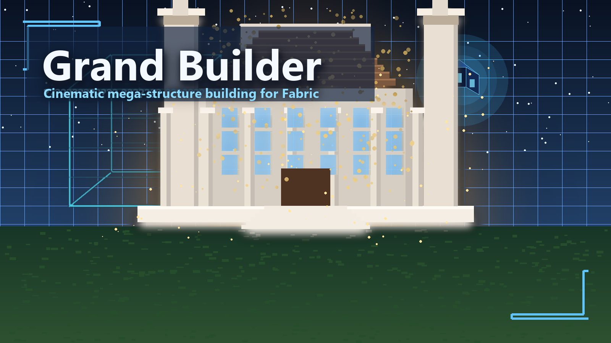

# Grand Builder

  

**Grand Builder** — эффектный Fabric-мод для Minecraft `1.21.11`, который позволяет зрелищно и управляемо строить большие структуры по схемам и собственным шаблонам.

Мод сохраняет главный вау-эффект анимированной постройки, но при этом делает механику пригодной для реальной игры и серверов:
- предпросмотр перед началом стройки
- подтверждение перед запуском
- переключение скорости в процессе
- пауза и продолжение
- безопасный откат последней постройки
- сохранение своих структур отдельным предметом `Builder Selector`
- загрузка внешних структур из папки `grand_builder/structures`
- поддержка `.nbt`, `.schem`, `.schematic`, `.litematic`

## Что умеет мод
- анимированно строить большие здания и комплексы
- показывать preview до подтверждения
- давать живой контроль скорости прямо во время стройки
- ставить стройку на паузу и продолжать без перезапуска
- откатывать последнюю постройку с защитой от случайного нажатия
- сохранять свои структуры в нескольких форматах
- работать в одиночной игре и на dedicated server
- использовать внешние схематики из отдельной папки

## Требования
- Minecraft `1.21.11`
- Fabric Loader `0.18.2+`
- Fabric API `0.139.4+1.21.11`
- Java `21+`

## Установка
1. Установи Fabric Loader для Minecraft `1.21.11`.
2. Положи `grand_builder-<версия>.jar` в папку `mods`.
3. Запусти игру или сервер.

## Быстрый старт
1. Получи предмет `Builder Core`.
2. Нажми ПКМ по воздуху или клавишу `B`, чтобы открыть `Builder Console`.
3. Выбери структуру и скорость.
4. Нажми `Сделать предпросмотр`.
5. Убедись, что позиция подходит.
6. Подтверди запуск предпросмотра ПКМ или клавишей `Enter`.
7. Во время стройки используй кнопки паузы, скорости и отката.

## Управление
- `B` — открыть `Builder Console`
- `Enter` — подтвердить активный предпросмотр
- `X` — отменить активный предпросмотр
- `ПКМ` с `Builder Core` — открыть консоль
- `ПКМ` с `Builder Core` при активном preview — подтвердить предпросмотр

## Сохранение своей структуры
1. Возьми `Builder Selector`.
2. ЛКМ по блоку ставит угол `A`.
3. ПКМ по блоку ставит угол `B`.
4. Открой `Builder Console`.
5. Выбери формат сохранения.
6. Нажми кнопку сохранения своей структуры.

Доступные режимы сохранения:
- `Runtime only`
- `1 vanilla .nbt`
- `Many .nbt pieces`
- `1 Sponge .schem`

## Внешние структуры
Поддерживаемые форматы:
- `.nbt`
- `.schem`
- `.schematic`
- `.litematic`

Папка для файлов:
- `<корень_игры_или_сервера>/grand_builder/structures`

Можно складывать файлы прямо в эту папку или использовать подпапки как наборы структур.

## Безопасность для сервера
По умолчанию мод использует безопасные параметры в `config/grand_builder.json`:
- режим прав доступа
- лимит блоков на одну постройку
- максимальный радиус размещения
- лимит одновременных строек
- поведение при выгрузке чанков
- правила отката
- whitelist и blacklist измерений
- правила замены блоков

Админ-команды:
- `/grandbuilder reload`
- `/grandbuilder status`

## Совместимость
- Мод рассчитан на Fabric `1.21.11`.
- Работает в singleplayer и на dedicated server.
- Внешние структуры на сервере должны лежать именно на стороне сервера.

## Известные нюансы
- Очень большие внешние схематики могут дольше парситься при первом обнаружении.
- Если целевые чанки выгружены, стройка может ждать их загрузки.
- Блоки, запрещённые правилами замены, будут пропущены и отмечены в статусе.

## Документация в репозитории
- [CHANGELOG.md](CHANGELOG.md)
- [PUBLISHING.md](PUBLISHING.md)
- [TESTING_CHECKLIST.md](TESTING_CHECKLIST.md)
- [GITHUB_SETUP_RU.md](GITHUB_SETUP_RU.md)

## Автор
`Login34245`
