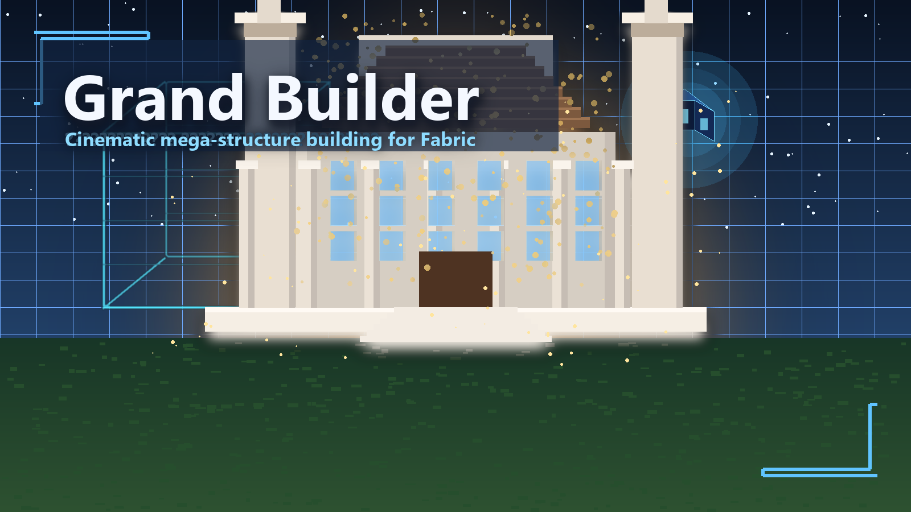

# Grand Builder

  

**Grand Builder** — эффектный Fabric-мод для Minecraft `1.21.11`, который позволяет зрелищно и управляемо строить большие структуры по схемам и собственным шаблонам.

Мод сохраняет главный вау-эффект анимированной постройки, но при этом делает механику пригодной для реальной игры и серверов:
- предпросмотр перед началом стройки
- подтверждение перед запуском
- переключение скорости в процессе
- пауза и продолжение
- безопасный откат последней постройки
- сохранение своих структур отдельным предметом `Builder Selector`
- загрузка внешних структур из папки `grand_builder/structures`
- поддержка `.nbt`, `.schem`, `.schematic`, `.litematic`

## Что умеет мод
- анимированно строить большие здания и комплексы
- показывать preview до подтверждения
- давать живой контроль скорости прямо во время стройки
- ставить стройку на паузу и продолжать без перезапуска
- откатывать последнюю постройку с защитой от случайного нажатия
- сохранять свои структуры в нескольких форматах
- работать в одиночной игре и на dedicated server
- использовать внешние схематики из отдельной папки

## Требования
- Minecraft `1.21.11`
- Fabric Loader `0.18.2+`
- Fabric API `0.139.4+1.21.11`
- Java `21+`

## Установка
1. Установи Fabric Loader для Minecraft `1.21.11`.
2. Положи `grand_builder-<версия>.jar` в папку `mods`.
3. Запусти игру или сервер.

## Быстрый старт
1. Получи предмет `Builder Core`.
2. Нажми ПКМ по воздуху или клавишу `B`, чтобы открыть `Builder Console`.
3. Выбери структуру и скорость.
4. Нажми `Сделать предпросмотр`.
5. Убедись, что позиция подходит.
6. Подтверди запуск предпросмотра ПКМ или клавишей `Enter`.
7. Во время стройки используй кнопки паузы, скорости и отката.

## Блоки на месте стройки
В консоли есть переключатель `Блоки: сохранять / заменять`, общий для всех режимов.
- `Сохранять` (по умолчанию): стройка заполняет только воздух. Уже стоящие блоки, жидкости и контейнеры не заменяются; воздух из схемы и подготовка ландшафта не сносят их.
- `Заменять`: мод может заменить существующие блоки, включая контейнеры, и расчистить клетки, где в схеме воздух. Включённая подготовка ландшафта также может убрать соседние препятствия.
- Вариант сохраняется при смене режима и повторном открытии консоли. Применяется при создании нового предпросмотра и остаётся неизменным для уже подготовленной стройки.
- При сохранении блоков строительный заряд имеет только визуальный взрыв. Разрушающий взрыв доступен при замене и требует прежнего отдельного подтверждения.
- Этот выбор задаёт правило конкретной стройки вместо старого `replaceRule` из конфига. В сетевой игре нужны одинаковые обновлённые JAR на клиенте и сервере.

## Управление
- `B` — открыть `Builder Console`
- `Enter` — подтвердить активный предпросмотр
- `X` — отменить активный предпросмотр
- `ПКМ` с `Builder Core` — открыть консоль
- `ПКМ` с `Builder Core` при активном preview — подтвердить предпросмотр

## Сохранение своей структуры
1. Возьми `Builder Selector`.
2. ЛКМ по блоку ставит угол `A`.
3. ПКМ по блоку ставит угол `B`.
4. Открой `Builder Console`.
5. Выбери формат сохранения.
6. Нажми кнопку сохранения своей структуры.

Доступные режимы сохранения:
- `Runtime only`
- `1 vanilla .nbt`
- `Many .nbt pieces`
- `1 Sponge .schem`

## Внешние структуры
Поддерживаемые форматы:
- `.nbt`
- `.schem`
- `.schematic`
- `.litematic`

Папка для файлов:
- `<корень_игры_или_сервера>/grand_builder/structures`

Можно складывать файлы прямо в эту папку или использовать подпапки как наборы структур.

## Импорт построек из карты и 3D-осмотр

В одиночной игре открой кнопку `Карта` в консоли. Можно выбрать мир из папки `saves`, перетащить папку Java-мира или ZIP на экран импорта либо положить карту в `grand_builder/world_imports` через кнопку открытия папки.

Нажми `Искать постройки`, выбери предложенный вариант и поправь шесть границ кнопками `-` / `+` прямо в меню. Рамка и текстурированный макет обновляются при изменении выделения. Перетаскивание мышью по области модели вращает камеру, колёсико меняет приближение. Кнопка `3D-осмотр` открывает модель на весь экран.

`Сохранить` экспортирует выделение в `.schem` в `grand_builder/structures` и выбирает новую структуру в консоли. Пустые отступы и данные блоков, например содержимое сундуков, сохраняются. Исходная карта читается без записи; при перетаскивании папки копируются только данные обычного мира, необходимые для импорта.

Кнопка `3D` рядом с выбором обычной структуры открывает такой же осмотр. Предпросмотр перед строительством также использует полупрозрачные модели блоков с текстурами; поворот и перемещение по назначенным клавишам продолжают работать.

Поиск оценивает строительные материалы и связанные области, поэтому предложенные границы могут включать землю или соседние объекты. Он проверяет до 4096 чанков рядом с точкой появления мира, а не гарантированно весь большой мир. Импорт рассчитан на современные Java-миры с Anvil-регионами; Bedrock-миры не поддерживаются. Предел выделения: 1 000 000 позиций. Для большого макета видимые блоки прореживаются до 16 384; это ограничение осмотра, а не сохранённой структуры. Жидкости и специальные модели блок-сущностей в макете пока не отображаются, но их данные сохраняются.

## Безопасность для сервера
По умолчанию мод использует безопасные параметры в `config/grand_builder.json`:
- режим прав доступа
- лимит блоков на одну постройку
- максимальный радиус размещения
- лимит одновременных строек
- поведение при выгрузке чанков
- правила отката
- whitelist и blacklist измерений
- правила замены блоков

Админ-команды:
- `/grandbuilder reload`
- `/grandbuilder status`

## Совместимость
- Мод рассчитан на Fabric `1.21.11`.
- Работает в singleplayer и на dedicated server.
- Внешние структуры на сервере должны лежать именно на стороне сервера.

## Известные нюансы
- Очень большие внешние схематики могут дольше парситься при первом обнаружении.
- Если целевые чанки выгружены, стройка может ждать их загрузки.
- Блоки, запрещённые правилами замены, будут пропущены и отмечены в статусе.

## Документация в репозитории
- [CHANGELOG.md](CHANGELOG.md)
- [PUBLISHING.md](PUBLISHING.md)
- [TESTING_CHECKLIST.md](TESTING_CHECKLIST.md)
- [GITHUB_SETUP_RU.md](GITHUB_SETUP_RU.md)

## Автор
`Login34245`
